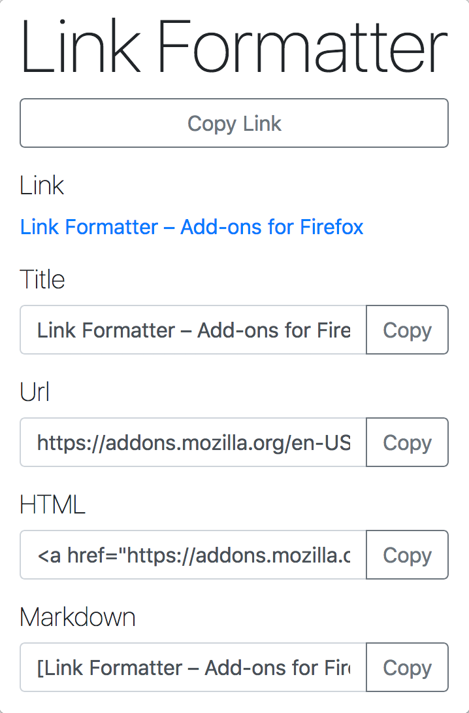

# Link Formatter

An extension/add-on for browsers to format links. When you click on the extension it will display the link of the current tab as an anchor link, html and markdown.  

This is useful to copy and paste links for webpages into blog posts, presentations, emails etc. The main motivation for making this was having to copy the title and url manually so many times.

### Firefox

- Visit https://addons.mozilla.org/en-US/firefox/extensions/ and search for 'Link Formatter'
- Direct link https://addons.mozilla.org/en-US/firefox/addon/link-formatter/

## Tutorials

- https://developer.mozilla.org/en-US/Add-ons/WebExtensions/Temporary_Installation_in_Firefox
- https://developer.mozilla.org/en-US/Add-ons/WebExtensions/Your_second_WebExtension
- https://github.com/mdn/webextensions-examples/blob/master/bookmark-it/background.js

## References

- https://medium.freecodecamp.org/how-to-link-to-a-specific-paragraph-in-your-medium-article-2018-table-of-contents-method-e66595fea549 The post that I read by Quincy Larson on Medium that led me to try out the below Anchor Links Chrome Extension
- https://github.com/castroalves/anchor-links This inspired me to write this Chrome extension as it is used for making it easier to add links to specific sections of your blog post on Medium

## Possible extensions

- Icons
- Add Context menu option
- Add multiple links to a list to copy all together
