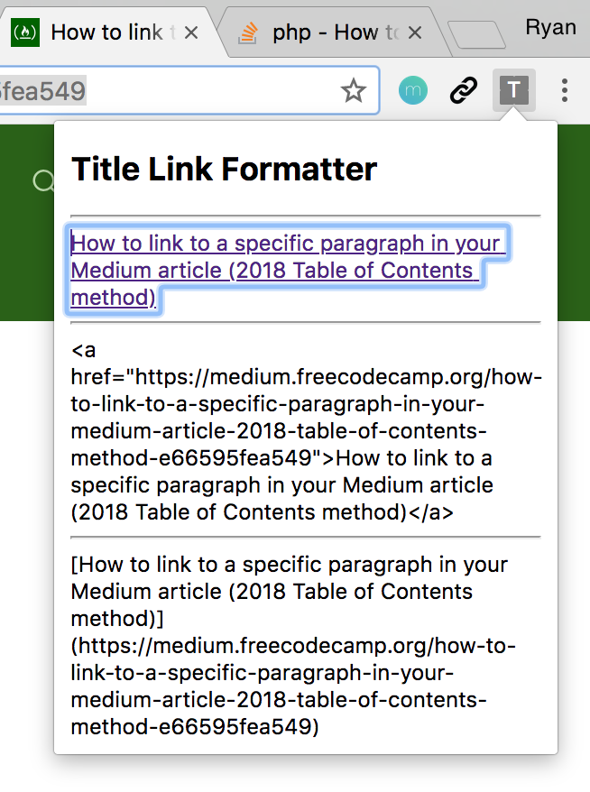

# Link Formatter

An extension/add-on for browsers to format links. Useful to copy and paste links for webpages into blog posts, presentations, emails etc. The main motivation for making this was having to copy the title and url manually so many times.

Link types:
- html link
- html link as plain text
- markdown link

## Installing and using the extension

- git clone this repo
- Open Chrome and visit chrome://extensions/
- Click on `LOAD UNPACKED` and select the folder you cloned this into
- Activate it if it isn't already
- Click the extension icon
- A popup will appear with the link
- Copy and paste the link into your blog or page!

## References

- https://medium.freecodecamp.org/how-to-link-to-a-specific-paragraph-in-your-medium-article-2018-table-of-contents-method-e66595fea549 The post that I read by Quincy Larson on Medium that led me to try out the below Anchor Links Chrome Extension
- https://github.com/castroalves/anchor-links This inspired me to write this Chrome extension as it is used for making it easier to add links to specific sections of your blog post on Medium
- https://stackoverflow.com/questions/11684454/getting-the-source-html-of-the-current-page-from-chrome-extension The stack overflow answer has working code to retrieve the HTML code from the current tab into your Chrome Extension. Excellent post https://stackoverflow.com/users/189093/paez

## Possible extensions

- Icon
- Copy to clipboard
