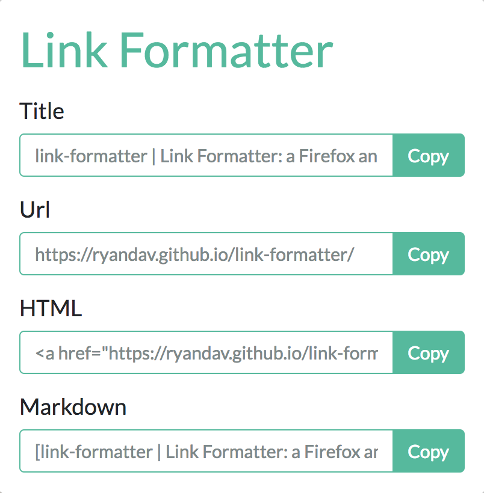

# Template Browser Extension

A template browser extension. This designed to be a quick way to setup a browser extension.

### Save locally on your computer and run extension

- Open your terminal
- cd to a directory where you want to save this
- run: `git clone git@github.com:ryandav/template-browser-extension.git`
- Then open the browser you wish to use it in and follow the below instructions

#### Chrome
- Visit `chrome://extensions/` in your Chrome browser
- Click `Load Unpacked`
- Select the folder you saved this in

#### Firefox
- Visit `about:debugging`
- Click on `Load Temporary Add-on`
- Select the folder you saved this in

## Libraries used

- [lgarron/clipboard-polyfill: Sane copying on the web.](https://github.com/lgarron/clipboard-polyfill)
- [Bootstrap · The most popular HTML, CSS, and JS library in the world.](https://getbootstrap.com/)
- [jQuery](https://jquery.com/)
- [Bootswatch.com theme Flatly](https://bootswatch.com/flatly/)

# Resources, guides and tutorials

The following pages were helpful when creating a web extension.

- [Debugging with Firefox Developer Tools - about:debugging](about:debugging)
- [Chrome Extensions - chrome://extensions/](chrome://extensions/)
- [Imagemagick to create favicon.ico with 16x16 and 32x32 sizes in it](https://gist.github.com/nateware/900d2d09f4884ac0c073)
- [audreyr/favicon-cheat-sheet: Obsessive cheat sheet to favicon sizes/types](https://github.com/audreyr/favicon-cheat-sheet)
- [Using media queries - CSS: Cascading Style Sheets | MDN](https://developer.mozilla.org/en-US/docs/Web/CSS/Media_Queries/Using_media_queries)
- [manifest.json - Mozilla | MDN](https://developer.mozilla.org/en-US/Add-ons/WebExtensions/manifest.json)
- [Manifest File Format - Google Chrome](https://developer.chrome.com/apps/manifest)
- [Your first extension - Mozilla | MDN](https://developer.mozilla.org/en-US/Add-ons/WebExtensions/Your_first_WebExtension)
- [Browser Extensions - Mozilla | MDN](https://developer.mozilla.org/en-US/Add-ons/WebExtensions)
- [How to link to a specific paragraph in your Medium article (2018 Table of Contents method)](https://medium.freecodecamp.org/how-to-link-to-a-specific-paragraph-in-your-medium-article-2018-table-of-contents-method-e66595fea549) The post that I read by Quincy Larson on Medium that led me to try out the below Anchor Links Chrome Extension
- [castroalves/anchor-links: Anchor Links is a free Chrome Extension to add anchor links to Medium and WordPress posts.](https://github.com/castroalves/anchor-links) This inspired me to write this Chrome extension as it is used for making it easier to add links to specific sections of your blog post on Medium
